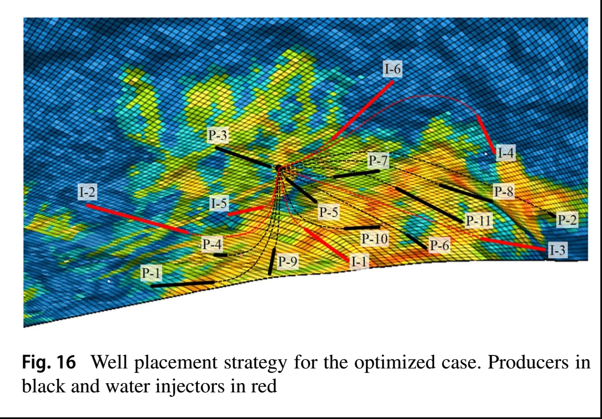

```{r setup, include=FALSE}
options(htmltools.dir.version = FALSE)
library(knitr)
library(gt)
library(kableExtra)
library(xaringanthemer)
library(ParBayesianOptimization)
library(latex2exp)
library(ggplot2)
ggplot2::theme_update(text=element_text(size=21))

style_duo_accent(
  primary_color = "#1b9aaa",
  secondary_color = "#ffc43d"
  #text_font_google = google_font("Coming Soon"),  #<< this is crazy but okay
  #header_font_google = google_font("Trade Winds") #<< very on brand for Tampa
)

knitr::opts_chunk$set(warning = FALSE, message = FALSE, cache = TRUE)
# options(knitr.table.format = "html")
library(tidyverse)
library(babynames)
library(fontawesome) # from github: https://github.com/rstudio/fontawesome
library(DiagrammeR)
```

<!-- <div class="my-footer"><span>arm.rbind.io/slides/xaringan</span></div> -->

<!-- this adds the link footer to all slides, depends on my-footer class in css-->
<!-- --- -->
<!-- name: xaringan-title -->
<!-- class: center, top -->
<!-- background-image: url(test2.jpg) -->
<!-- background-size: cover -->

<!-- # BayesOpt : A New Sample Efficient Workflow for Reservoir Optimization under Uncertainty -->

<!-- <!-- # --> -->

<!-- <!-- ### .fancy[Making slides in R Markdown] --> -->

<!-- <br> -->
<!-- <br> -->
<!-- ### .large[Peyman Kor | Energy Resource Department, University of Stavanger] -->
<!-- ### .large[Presentation for DigiRes Meeting, 30 June 2021] -->
<!-- <!-- this ends up being the title slide since seal = FALSE--> -->
---

class: center, middle
## Part I) Problem statement

---
## Part I) Problem statement:

--

- In reservoir optimization, we can have different objectives: Recovery Factor (RF), Net Present Value (NPV), ...

$$
\begin{aligned}
& \underset{\mathbf{u}}{\text{maximize}} & & Obj \ Func(\mathbf{u}) \\
& \text{subject to}
& & \mathbf{u} \subseteq U \\
\end{aligned}
$$

--

- $\mathbf{u}$ is a decision variable: could be injection rate(s), well location(s) or order of drilling well(s). In this paper (Part II of numerical examples), $\mathbf{u}$ is the injection rates of 8 wells in 10 years. (Reservoir Life Cycle) 

--

- **<span style="color:blue"> Deterministic Optimization:</span>**

$$Obj \ Func(\mathbf{u})=J(\mathbf{u, G})= \sum_{k=1}^{K} \Bigg [\sum_{j=1}^{N_p}p_oq_{o,j,k}(\mathbf{u, G}) - \sum_{j=1}^{N_p}p_{wp}q_{wp,j,k}(\mathbf{u, G}) \sum_{j=1}^{N_{wi}}p_{wi}q_{wi,j,k}(\mathbf{u, G}) \Bigg]\frac{\Delta t_k}{(1+b)^{\frac{t_k}{D}}}$$

- The $G$ in above Equation is "the geological model".
--

$$\color{blue} {\text{Robust Optimization}} \qquad \qquad \overline{J}(\mathbf{u}) = \frac{\sum_{re=1}^{n_e} J(\mathbf{u,G_{re}})}{n_e}$$
--
---
## Part I) Problem Statement

$$\color{blue} {\text{Robust Optimization}} \qquad \qquad \overline{J}(\mathbf{u}) = \frac{\sum_{re=1}^{n_e} J(\mathbf{u,G_{re}})}{n_e}$$

--

#### Example case: 

- Lets' say you are optimizing the well control problem with dimension, $d=10$.

--

- Number of 3D geological realizations is $n_e=100$ and running each possible $u^*$in commercial reservoir simulator, at each realization takes ~ 1 hour. Then time it takes to calculate $\overline{J}(u^*)$ is ~ 100 hours.

--

- With 6 month CPU running time budget, the total available budget is to run is ~ 50.

--

- Availability of only 50 $\overline{J}(u^*)$ evaluations is a small budget, considering the ten-dimensional optimization problem.

--

#### **<span style="color:red"> Problem:</span>**<span style="color:red">  $\overline{J}(u)$ is expensive function, meaning the # times we can evaluate it is severely limited. </span>


<!-- #### **<span style="color:green"> Solution:</span>**<span style="color:green">  Bayesian Optimization (BayesOpt) propose a new workflow to conduct optimization at the small $\overline{J}(u)$ budget, without affecting the optimum solution. -->

---

## Part I) Problem Statement: OLYMPUS Optimization Benchmark Challenge (what can be learned?)

--

- Task 2: field development optimization
- Winner: V. L. S. Silva et al. Petrobras Research and Development Center – CENPES
--

- Optimization Algorithm: Variant of Genetic Algorithm (GenocopIII)

--

```{r, echo=FALSE, out.width="40%", fig.align='center'}

```

--

- Problem:  **<span style="color:red"> 105,000 Reservoir Simulations Needed</span>**
- Assume 1 hr forward run : $\frac{105000\times1}{24\times 360}$ ~ 12 years

---

## Part I) Problem Statement: How does the **<span style="color:blue"> industry</span>** deal with this problem?

--

1) Work with a "one" geological model

$$J(\mathbf{u, G})= \sum_{k=1}^{K} \Bigg [\sum_{j=1}^{N_p}p_oq_{o,j,k}(\mathbf{u, G}) - \sum_{j=1}^{N_p}p_{wp}q_{wp,j,k}(\mathbf{u, G}) \sum_{j=1}^{N_{wi}}p_{wi}q_{wi,j,k}(\mathbf{u, G}) \Bigg]\frac{\Delta t_k}{(1+b)^{\frac{t_k}{D}}}$$
--

- **<span style="color:red"> Problem:</span>** Ignoring uncertainty in geological model.

--

2) Calculate mean of geological realizations and optimize that one

$$J(\mathbf{u, \overline{G}})= \sum_{k=1}^{K} \Bigg [\sum_{j=1}^{N_p}p_oq_{o,j,k}(\mathbf{u, \overline{G}}) - \sum_{j=1}^{N_p}p_{wp}q_{wp,j,k}(\mathbf{u, \overline{G}}) \sum_{j=1}^{N_{wi}}p_{wi}q_{wi,j,k}(\mathbf{u, \overline{G}}) \Bigg]\frac{\Delta t_k}{(1+b)^{\frac{t_k}{D}}}$$
--

- **<span style="color:red"> Problem:</span>** Problematic in non-linear, non-smooth forward model, like reservoir simulation.

--

3) Upscaling the fine-grid geological model to coarse grid
- **<span style="color:red"> Problem:</span>** Inherently difficult to find representative coarse-gird model.

---

## Part I) Problem Statement: How does  **<span style="color:blue"> academic research</span>** deal with this problem?

--

#### Two general approaches have been introduced:

--

1) **<span style="color:red"> Targets the flow problem</span>**

- Replacing the full-Physic (high-fidelity) flow simulation model with a reduced order model (lower-fidelity) 

--

- $$J(\mathbf{u, G})= \sum_{k=1}^{K} \Bigg [\sum_{j=1}^{N_p}p_o \color{red}{q_{o,j,k}} (\mathbf{u, G}) - \sum_{j=1}^{N_p}p_{wp}\color{red}{q_{wp,j,k}}(\mathbf{u, G}) \sum_{j=1}^{N_{wi}}p_{wi}\color{red}{q_{wi,j,k}}(\mathbf{u, G}) \Bigg]\frac{\Delta t_k}{(1+b)^{\frac{t_k}{D}}}$$

--

- Capacitance-Resistance Models, ML and DL-based Surrogates, Streamline-based Simulation,...(2017 Paper)

--

2)  **<span style="color:red"> Target the Dimension of Decision Variable/Number of Realizations</span>**

--

- Trigonometric, polynomial approximation, and principal component analysis 
- Transfer $\mathbf{u}$ from $D$ dimension to $D^-$, where $D^- < D$
- Or Transfer $n_e$ from  $re$ dimension to $re^-$, where $re^- < re$

---

## Bayesian Optimization: This Paper

--

- Neither Category (1) or (2)

--

- **<span style="color:red"> Category (3): make optimization algorithm more efficient than PSO, GA, EnOpt...</span>**
--

- Efficiency means: as few as possible use of 
- $$\overline{J}(\mathbf{u}) = \frac{\sum_{re=1}^{n_e} J(\mathbf{u,G_{re}})}{n_e}$$
- Without sacrificing the near-optimal solution

--
---

## Part II) Bayesian Optimization - How it works? 

--

- 1D Case: True Function to be Optimized

--

```{r loadlibraries, message=FALSE, echo=FALSE, error=FALSE}

one_d_fun <- function(x) {
  y <- (1-1/2*((sin(12*x)/(1+x))+(2*cos(7*x)*x^5)+0.7))
  return(y)
}

xmin <- optimize(one_d_fun, c(0, 1), tol = 0.0001, maximum = TRUE)

library(DiceKriging)
library(mvtnorm)
library(tidyverse)

library(tibble)
library(kableExtra)

library(tidyverse)
library(latex2exp)

library(patchwork)
library(gridExtra)
library(tidyverse)

library(ParBayesianOptimization)

```

```{r onedplot, echo=FALSE, fig.retina=2, fig.align='center', fig.width= 16, fig.height= 7, warning=FALSE}

x_domain <- seq(0,1,0.01)
y_domain <- one_d_fun(x_domain)

data_domain <- tibble(x=x_domain, y= y_domain)

df_text <- data.frame(
  x = 0.39,
  y = 0,
  text = c("bottom-left")
)
ggplot(data_domain, aes(x,y)) +
  geom_point() +
  geom_vline(xintercept = 0.390, linetype="dotted", 
                color = "blue", size=1.5) +
   annotate("text", x=0.32, y=0, label= "x_M", hjust = 0, vjust=+1 ,colour = "blue") +
  ylim(0,1.04) +
  ylab("f(x)")

```

```{r echo=FALSE, message=FALSE}
set.seed(123)
# ######################################################
# one_d_fun <- function(x) {
#   y <- (1-1/2*((sin(12*x)/(1+x))+(2*cos(7*x)*x^5)+0.7))
#   return(y)
# }
# #################################################
# 
# xmin <- optimize(one_d_fun, c(0, 1), tol = 0.0001, maximum = TRUE)
#########################################################

x_domain <- seq(0,1,0.01)
y_domain <- one_d_fun(x_domain)
#y_domain <- max(y_domain) - min(y_domain)
data_domain <- tibble(x=x_domain, y= y_domain)
#data_domain

#r <- max(vec) - min(vec)
#vec <- (vec - min(vec))/r
#########################################################
obs_data_return <- function(x) {
  y_norm <- one_d_fun(x)
  #y_norm = y-mean(y)
  df <- data.frame(x,y_norm)
}
#################################

km_model <- function(obs_data, predict_x) {
  
  model <- km(~0, design = data.frame(x=obs_data$x), response = obs_data$y_norm, multistart = 100, 
              control =list(trace=FALSE))
  paste0(model@covariance@range.val)
  p.SK <- predict(model, newdata=data.frame(x=predict_x), type="SK",cov.compute = TRUE)
  return(list(predict_list=p.SK,cov_par=model@covariance@range.val))
}

###################################

plot_post <- function(predict_list,x_predict,obs_data) {
  
  mv_sample <- mvtnorm::rmvnorm(100, predict_list$mean, predict_list$cov)
  ss <- t(mv_sample)
  
  dat <-data.frame(x=x_predict, ss) %>% 
    pivot_longer(-x, names_to = "rep", values_to = "value") %>% 
    mutate(rep=as.numeric(as.factor(rep)))
  
  data_gp <- data.frame(x=x_predict,upper95=predict_list$upper95,
                        lower95=predict_list$lower95, mean_curve=predict_list$mean)
  
  
  ggplot(dat,aes(x=x,y=value)) + 
    geom_line(aes(group=as.factor(rep), color="blue"), alpha=0.7) +
    #scale_colour_manual("",values = cols) +
    scale_color_manual("", values = c("black","blue", "red"), 
                       labels=c("True Function", "Sample from the posterior","Mean Value")) +#REPLICATES +
    geom_ribbon(data = data_gp, 
                aes(x, 
                    y = mean_curve, 
                    ymin = lower95, 
                    ymax = upper95,
                    fill="grey"), alpha = 0.6, show.legend = T) +
    scale_fill_manual("",values="gray", labels="95% CI") +
    geom_line(dat = data_gp, aes(x=x,y=mean_curve, color="red"), size=1) + #MEAN
    geom_point(data=obs_data,aes(x=x,y=y_norm),fill="green", color="yellow",shape=23, size=2) +
    geom_line(data=data_domain,aes(x=x_domain,y=y_domain, color="black"),size=1, alpha=0.7) +
    scale_y_continuous(lim=c(-0.5,1.2)) +
    scale_x_continuous(lim=c(0,1)) +
    theme(legend.position="none") +
    theme(legend.text=element_text(size=4)) +
    theme(text = element_text(size=6)) +
    theme(axis.title.x = element_blank(),
          axis.title.y = element_blank())
    #theme(legend.position="top")
  
}

##################################################################

utility_cal <- function(predict_list, x_predict,obs_data,eps) {
 
  y_max <- max(obs_data$y_norm)
  
  z <- (predict_list$mean - y_max - eps) / (predict_list$sd)
  
  utility <- (predict_list$mean - y_max - eps) * pnorm(z) + (predict_list$sd) * dnorm(z)
  
  new_x <- x_predict[which(utility==max(utility))] 
  
  return(new_x)
}

########################################################################


utility_cal_plot <- function(predict_list, x_predict,obs_data,eps,x_next) {
  
  y_max <- max(obs_data$y_norm)
  z <- (predict_list$mean - y_max - eps) / (predict_list$sd)
  
  utility <- (predict_list$mean - y_max - eps) * pnorm(z) + (predict_list$sd) * dnorm(z)
  
  data_utility <- data.frame(x=x_predict, utility=utility)
  
  ggplot(data_utility,aes(x,utility)) +
    geom_line() +
    scale_y_continuous(position = "right") +
    theme(text = element_text(size=6)) +
    geom_vline(xintercept = x_next, linetype="dotted", 
                color = "blue", size=0.5) +
   annotate("text", x=x_next, y=0, label= "x_next", hjust = -0.5, vjust=-2 ,colour = "blue") +
    theme(axis.title.x = element_blank(),
          axis.title.y = element_blank())
}

###############################################


plot_post_indi <- function(predict_list,x_predict,obs_data) {
  
  
  mv_sample <- mvtnorm::rmvnorm(100, predict_list$mean, predict_list$cov)
  ss <- t(mv_sample)
  
  dat <-data.frame(x=x_predict, ss) %>% 
    pivot_longer(-x, names_to = "rep", values_to = "value") %>% 
    mutate(rep=as.numeric(as.factor(rep)))
  
  data_gp <- data.frame(x=x_predict,upper95=predict_list$upper95,
                        lower95=predict_list$lower95, mean_curve=predict_list$mean)
  
  
  ggplot(dat,aes(x=x,y=value)) + 
    geom_line(aes(group=as.factor(rep), color="blue"), alpha=0.7) +
    #scale_colour_manual("",values = cols) +
    scale_color_manual("", values = c("black","blue", "red"), 
                       labels=c("True Function","Sample from the posterior","Mean Value")) +#REPLICATES +
    geom_ribbon(data = data_gp, 
                aes(x, 
                    y = mean_curve, 
                    ymin = lower95, 
                    ymax = upper95,
                    fill="grey"), alpha = 0.6, show.legend = T) +
    scale_fill_manual("",values="gray", labels="95% CI") +
    geom_line(dat = data_gp, aes(x=x,y=mean_curve, color="red"), size=1) + #MEAN
    geom_point(data=obs_data,aes(x=x,y=y_norm),fill="green", color="yellow",shape=23, size=4) +
    geom_line(data=data_domain,aes(x=x_domain,y=y_domain, color="black"),size=1, alpha=0.7) +
    scale_y_continuous(lim=c(-0.5,1.25)) +
    scale_x_continuous(lim=c(0,1)) +
    xlab("x") +
    ylab("f(x)") +
    theme(legend.position="top") 
  
}

utility_cal_plot_ind <- function(predict_list, x_predict,obs_data,eps,x_next) {
  
  y_max <- max(obs_data$y_norm)
  z <- (predict_list$mean - y_max - eps) / (predict_list$sd)
  
  utility <- (predict_list$mean - y_max - eps) * pnorm(z) + (predict_list$sd) * dnorm(z)
  
  data_utility <- data.frame(x=x_predict, utility=utility)
  
  ggplot(data_utility,aes(x,utility)) +
    geom_line() +
    geom_vline(xintercept = x_next, linetype="dotted", 
                color = "blue", size=1) +
   annotate("text", x=x_next, y=0, label= "x_next", hjust = 1.2, vjust=-1 ,colour = "blue") 
   
}

```

---
## Part II) Bayesian Optimization - How it works? 

--

- What is Initialization?

--

```{r, fig.retina=2, warning=FALSE, fig.align='left', echo=FALSE, fig.align='center', fig.width= 16, fig.height= 7}
set.seed(123)
x <- c(0.05,0.2,0.5,0.6,0.95)
obs_data_ini <- obs_data_return(x)
x_predict <- seq(0,1,0.005)
ggplot(data=obs_data_ini) +
  geom_point(aes(x=x,y=y_norm),fill="green", color="yellow",shape=23, size=10) +
   scale_y_continuous(lim=c(-0.5,1.25)) +
    scale_x_continuous(lim=c(0,1)) +
    xlab("x") +
    ylab("f(x)") 
```

---
##  Part II) Bayesian Optimization - How it works? 

--

- Build probabilistic Model out of initial points?

--

```{r exampleshow, fig.retina=2, warning=FALSE, fig.align='left', echo=FALSE, fig.align='center', fig.width= 16, fig.height= 7}

set.seed(123)
x <- c(0.05,0.2,0.5,0.6,0.95)
obs_data <- obs_data_return(x)
x_predict <- seq(0,1,0.005)

predict_list <- km_model(obs_data,x_predict)
posterior_1 <- plot_post_indi(predict_list$predict_list,x_predict,obs_data)

new_x_point1 <- utility_cal(predict_list$predict_list,x_predict,obs_data,0.1)
utility_1 <- utility_cal_plot_ind(predict_list$predict_list,x_predict,obs_data,0.1, new_x_point1)

posterior_1 
#  utility_1
```

---

## Part II) Bayesian Optimization - How it works? 
--

- How to find the next point to query from the expensive function?

--

```{r exampleshow0, fig.retina=2, warning=FALSE, fig.align='left', echo=FALSE, fig.align='center', fig.width= 16, fig.height= 7}

posterior_1 +
  geom_hline(yintercept = max(obs_data$y_norm), size=2)
#max(obs_data$y_norm)
```

---

## Part II) Bayesian Optimization - How it works? 

--

- How to find the next point to query from the expensive function?

--
```{r exampleshow1, fig.retina=2, warning=FALSE, fig.align='left', echo=FALSE, fig.align='center', fig.width= 16, fig.height= 7}

posterior_1 + 
  geom_hline(yintercept = max(obs_data$y_norm), size=2) +
  annotate("rect", xmin = -Inf, xmax = Inf, ymin = -Inf, ymax = max(obs_data$y_norm), fill = "black", alpha = 0.7, color = NA)
#geom_hline(yintercept = max(obs_data$y_norm) )
#max(obs_data$y_norm)
```

---

```{r, fig.retina=2, warning=FALSE, fig.align='left', echo=FALSE, fig.align='center', fig.width= 16, fig.height= 10}
posterior_1_ano <- posterior_1 + annotate("rect", xmin = -Inf, xmax = Inf, ymin = -Inf, ymax = max(obs_data$y_norm), fill = "black", alpha = 0.7, color = NA) 

posterior_1_ano /
  utility_1
```

---

## Part II) Bayesian Optimization - How it works? 

--

- What is sequential sampling in BayesOpt?

--
```{r allinone, echo=FALSE, fig.align='left', fig.retina=2, message=FALSE, warning=FALSE,fig.width= 16, fig.height= 8}
set.seed(123)

x <- c(0.05,0.2,0.5,0.6,0.95)
obs_data <- obs_data_return(x)
x_predict <- seq(0,1,0.005)

predict_list <- km_model(obs_data,x_predict)
posterior_1 <- plot_post(predict_list$predict_list,x_predict,obs_data)

new_x_point1 <- utility_cal(predict_list$predict_list,x_predict,obs_data,0.1)
utility_1 <- utility_cal_plot(predict_list$predict_list,x_predict,obs_data,0.1, new_x_point1)
#utility_1
#################

x2 <- c(0.05,0.15,0.2,0.5,0.6,0.95,new_x_point1)
obs_data2 <- obs_data_return(x2)
x_predict <- seq(0,1,0.005)

predict_list2 <- km_model(obs_data2,x_predict)
posterior_2 <- plot_post(predict_list2$predict_list,x_predict,obs_data2)
new_x_point2 <- utility_cal(predict_list2$predict_list,x_predict,obs_data2,0.1)
utility_2 <- utility_cal_plot(predict_list2$predict_list,x_predict,obs_data2,0.1, new_x_point2)

###################

x3 <- c(0.05,0.15,0.2,0.5,0.6,0.95,new_x_point1,new_x_point2)
obs_data3 <- obs_data_return(x3)
x_predict <- seq(0,1,0.005)

predict_list3 <- km_model(obs_data3,x_predict)
posterior_3 <- plot_post(predict_list3$predict_list,x_predict,obs_data3)

new_x_point3 <- utility_cal(predict_list3$predict_list,x_predict,obs_data3,0.1)
utility_3 <- utility_cal_plot(predict_list3$predict_list,x_predict,obs_data3,0.1, new_x_point3)

##################

# (posterior_1 + utility_1) / 
# (posterior_2 + utility_2) / 
# (posterior_3 + utility_3) 
  #plot_layout(ncol = 2)


library(gridExtra)
grid.arrange(posterior_1, utility_1, posterior_2, utility_2, posterior_3, utility_3, ncol=2,
             widths = c(6, 4))  
# (posterior_3 + utility_3) , ncol=2)

# (posterior_1 + theme(plot.margin = unit(c(0,30,0,0), "pt"))) +
# (utility_1 + theme(plot.margin = unit(c(0,0,0,30), "pt")))
# p1 + p2 + p3 + p4 + 
#   plot_layout(ncol = 3)
```

---

## Part III) Who else is working on Bayesian Optimization for subsurface application?

--

- Unaware of any peer-reviewed publication about this algorithm for optimization

--

- Parallel work in the US, (The University of Texas at Austin + IBM)

```{r, echo=FALSE, out.width="60%", fig.align='center'}

```


